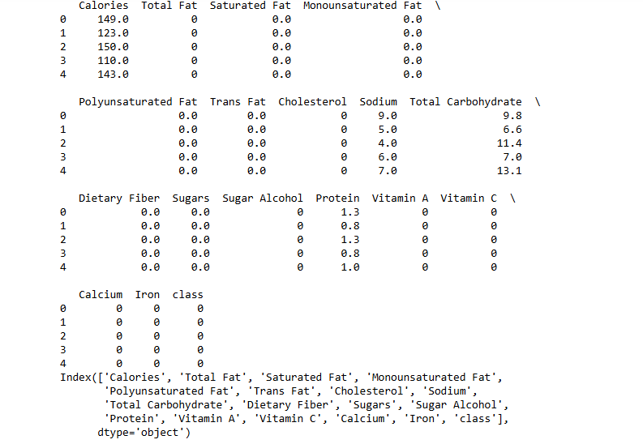
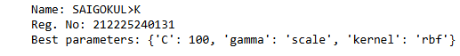
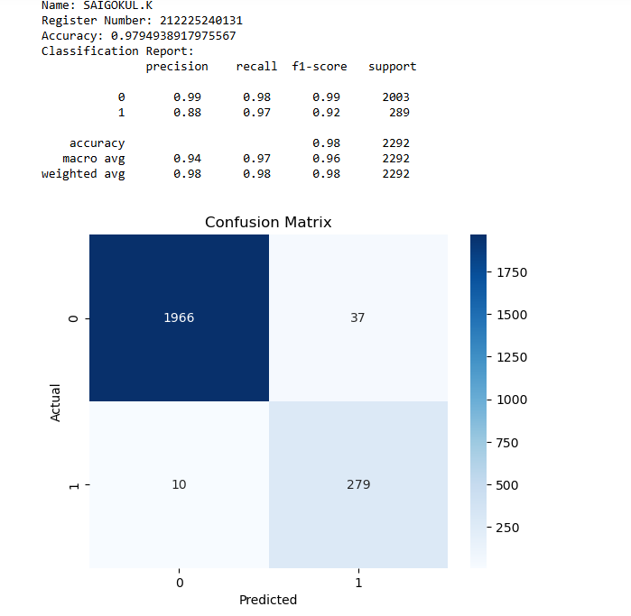

# BLENDED LEARNING
# Implementation of Support Vector Machine for Classifying Food Choices for Diabetic Patients

## AIM:
To implement a Support Vector Machine (SVM) model to classify food items and optimize hyperparameters for better accuracy.

## Equipments Required:
1. Hardware – PCs
2. Anaconda – Python 3.7 Installation / Jupyter notebook

## Algorithm
1.Load Data
Import and prepare the dataset to initiate the analysis workflow.

2.Explore Data
Examine the data to understand key patterns, distributions, and feature relationships.

3.Select Features
Choose the most impactful features to improve model accuracy and reduce complexity.

4.Split Data
Partition the dataset into training and testing sets for validation purposes.

5.Scale Features
Normalize feature values to maintain consistent scales, ensuring stability during training.

6.Train Model with Hyperparameter Tuning
Fit the model to the training data while adjusting hyperparameters to enhance performance.

7.Evaluate Model
Assess the model’s accuracy and effectiveness on the testing set using performance metrics.

## Program:
```
/*
Program to implement SVM for food classification for diabetic patients.
Developed by: gowtham u
RegisterNumber:25005013
import pandas as pd
from sklearn.model_selection import train_test_split, GridSearchCV
from sklearn.preprocessing import StandardScaler
from sklearn.svm import SVC
from sklearn.metrics import accuracy_score, classification_report, confusion_matrix
import seaborn as sns
import matplotlib.pyplot as plt
data = pd.read_csv('food_items_binary.csv')
print(data.head())
print(data.columns)

features=['Calories', 'Total Fat', 'Saturated Fat','Sugars', 'Dietary Fiber', 'Protein']
target='class'
X=data[features]
y=data[target]
X_train, X_test, y_train, y_test = train_test_split(X, y, test_size=0.3, random_state=42)
scaler=StandardScaler()
X_train = scaler.fit_transform(X_train)
X_test = scaler.transform(X_test)

svm = SVC()
param_grid={
    'C': [0.1, 1, 10, 100],
    'kernel': ['linear','rbf'],
    'gamma': ['scale','auto']
}
grid_search=GridSearchCV(svm, param_grid, cv=5, scoring='accuracy')
grid_search.fit(X_train, y_train)

best_model = grid_search.best_estimator_
print('Name: SAIGOKUL>K')
print('Reg. No: 212225240131')
print("Best parameters:",grid_search.best_params_)
y_pred=best_model.predict(X_test)

accuracy = accuracy_score(y_test,y_pred)
print("Name: GOWTHAM U")
print("Register Number: 212225040099")
print("Accuracy:",accuracy)
print("Classification Report:\n",classification_report(y_test, y_pred))

conf_matrix = confusion_matrix(y_test, y_pred)
sns.heatmap(conf_matrix, annot=True, fmt="d", cmap="Blues")
plt.xlabel("Predicted")
plt.ylabel("Actual")
plt.title("Confusion Matrix")
plt.show()  
*/
```

## Output:





## Result:
Thus, the SVM model was successfully implemented to classify food items for diabetic patients, with hyperparameter tuning optimizing the model's performance.
